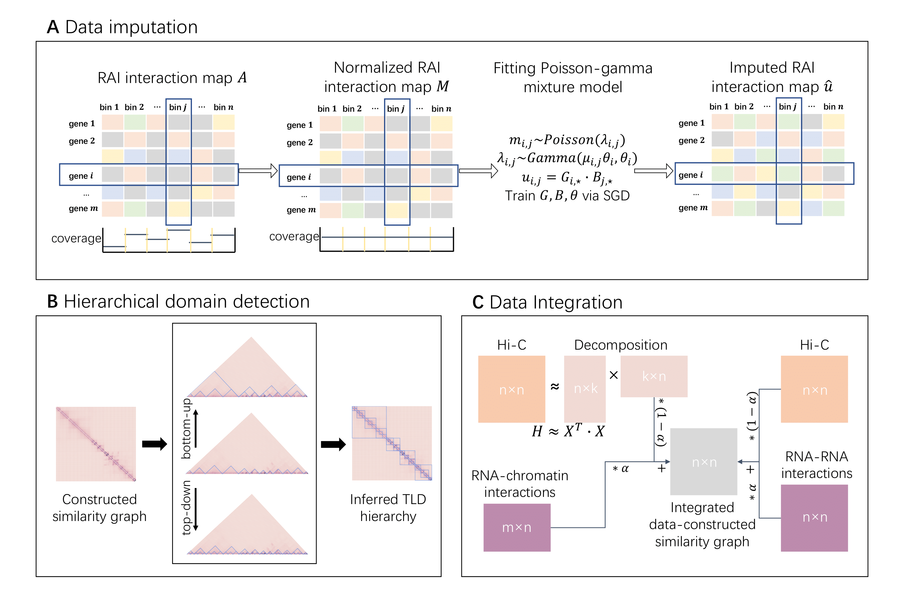

# SuperTLD



SuperTLD is a novel method proposed to infer the hierarchical structure of TAD-like domains (TLDs) from RNA-associated interactions (RAIs). 
SuperTLD comprises the data imputation and hierarchical domain detection. 
SuperTLD supports RAI's asymmetric or symmetric contact map as input. 
Users can test the TAD inference potentiality from the integration of Hi-C and RAIs via SuperTAD.   
We also provide the scripts of evaluation performed in the paper.

## Requirements
* python3
* numpy
* pandas
* scipy
* SuperTAD v1.2 (https://github.com/deepomicslab/SuperTAD)

## Installation
Run the following from a terminal
```angular2html
pip install supertld
```

## Instructions
In this section, we show how to run SuperTLD with the example data.
### Data preparation 
The example data can be downloaded from the [zenode repository](https://zenodo.org/record/6817547).
Download the example_data.zip and uncompress the example_data.zip into the directory of `./data`.

### Run SuperTLD

```python
import supertld
import numpy as np

# load the RAI contact map and declare its chromosome and resolution
raiMap = np.loadtxt("./data/iMARGI_chr22_RAI_matrix_100kb.txt")
raiChrom="chr22"
raiResolution=100000
outputFile = "./data/iMARGI_chr22_result.txt"   # declare the path of output file

# create a SuperTLD object 
model = supertld.SupertadSparse(chrom=raiChrom, resolution=raiResolution, supertad=<executing_path_of_SuperTAD>)

# run SuperTLD on RAI contact map to infer TLDs
_, TLDresult = model.pipeline(inputMatrix=raiMap, outpath=outputFile)

# perform evaluation
# load Hi-C, TF ChIP-seq, and histone ChIP-seq data
hicMap = "./data/HEK293T_chr22_100KR_matrix.txt"    
bed = ["./data/CTCF_ENCFF206AQV.bed"]   
bedgraph = ["./data/H3K27ME3_hg38_GSM3907592.bedgraph", "./data/H3K36me3_hg38_ENCSR910LIE.bedgraph"]
# detect TADs from Hi-C contact map, if necessary
model.Perform_SuperTAD(inputPath=hicMap)
# create the evaluate object
evaluateModel = supertld.Evaluate(chrom=raiChrom, resolution=raiResolution, hicPath=hicMap, bed=bed, bedgraph=bedgraph)
# run the evaluation 
evaluateResult = evaluateModel.run(resultList=[outputFile], outPath=outputFile+".evaluateResult.txt")


# run SuperTLD on integration of RAIs and Hi-C
# test integrated data where alpha ranges from 0 to 1
matrixLists, TLDresults = model.pipeline(inputMatrix=raiMap, outpath=outputFile, hic=hicMap, alpha=None)

# run evaluation on all the integrated data
evaluateResult = evaluateModel.run(resultList=matrixLists, outPath=outputFile+".allAlpha_evaluateResult.txt")
```
### Parameters
```python
model = SupertadSparse(chrom="chr1", resolution=100000, supertad=None)
```
* chrom: string, required, default: chr1\
The chromosome of the input RAI interaction map.
* resolution: int, required, default: 100000\
The bin resolution of the input RAI interaction map.
* supertad: string, required\
The executing path of SuperTAD.
```python
model.pipeline(inputMatrix=None, outpath="./norm_matrix.txt", hic=None, alpha=None)
```
* inputMatrix: 2darray, required\
The RAI interaction map.
* outpath: string, optional, default: "./norm_matrix.txt"\
The output path of SuperTLD.
* hic: string, optional\
If the file path of Hi-C contact map is given, perform the integration of RAI and HI-C.
* alpha: float, optional, default: None
If hic parameter is given, alpha is needed to control the integration. User can provide a value ranging from 0 to 1. 
The default None gives all the integration result (set alpha from 0 to 1 by 0.05).
```python
evaluateModel = Evaluate(chrom="chr1", resolution=100000, hicPath=None, bed=None, bedgraph=None)
```
* chrom: string, required, default: chr1\
The chromosome of the result.
* resolution: int, required, default: 100000\
The bin resolution of the RAI interaction map.
* hicPath: string, required\
The path of corresponding Hi-C contact map.
* bed: list, optional\
The list of TF ChIP-seq data (.bed).
* bedgraph: list, optional\
The list of H3K27me3/H3K36me3 ChIP-seq data (.bedgraph)
```python
evaluateModel(resultList=None, outPath="./")
```
* resultList: list, required\
The list of result matrix.
* outPath: string, optional, default: "./"\
The output path of evaluation result.

The result of inferred TLDs are suffixed with `.multi2D_AllH2_sparse.tsv`.  
For the evaluation result, the first row is the result of TLDs, and the second row is the result of TLDs.
The first column is the PCC of contact map (compared with Hi-C), the second column is the PCC of distance decay, 
the third and fourth column are OR and NMI respectively,
the fifth and sixth are the CTCF fold change and its pvalue, and the seventh column is the percentage of domains enriched in H3K27me3/H3K36me3 marks.


## Contact
Feel free to open an issue in Github or contact `yuwzhang7-c@my.cityu.edu.hk` if you have any problem in using SuperTLD.

## License
This project is licensed under the MIT License - see the LICENSE.md file for details.

